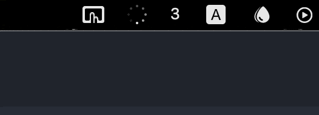

# 🦀 Crab - see how loud you are


🦀 Crab is a minimalistic (currently only 🍏 MacOS) Rust app,
which adds a system tray icon.
The **system tray icon shows a number between 0 and 100 describing how loud is the 🎤 input captured by the default input device** on your system.
This helps you to **NOT 🔊 SHOUT DURING A CALL WITH NOISE CANCELLING 🎧 HEADPHONES**.

🎥 Pics or didn't happen? 👇👇



This is useful in the age of 📞 calls and 🎧 noise cancelling headphones - if you ever caught yourself 🔊screaming🔊 during a call (or a flatmate frowned at you 👀) - this is the thing for you.

The code is super simple - **<75 lines of code**. You should understand it easily and be able to tweak it even if you are new to Rust.

## Running

A pre-built binary for MacOS is on the releases page, however I recommend you build this yourself.
This project uses cargo - use it to build or run the app.

```
$ cargo build --release # Builds the app (artifact inside the `target` directory)
$ cargo run --release
```

## Notes

- Running the app from VSCode terminal does not work properly - the system dialog to request permissions for audio recording does
  not trigger correctly. Use the vanilla terminal/iTerm2/something else to run the app.

- Only MacOS is supported atm.

- I was only mildly familiar with Rust at the time of writing, it serves mostly as a Rust learning project.

## Ideas for future

Some ideas, which may come to reality one day:

- Add a background color (eg. yellow/red) when the volume is high
- Support Linux/Windows
- Allow selecting different input devices
- Allow configuration (colors/thresholds) via a GUI/command line options
- Find out a way to support MacOS without `unsafe` blocks of code
